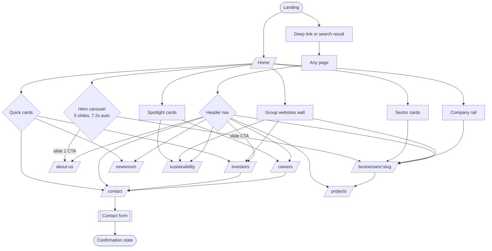
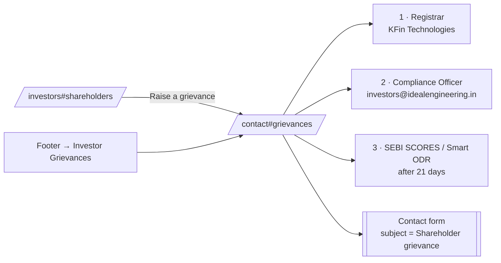
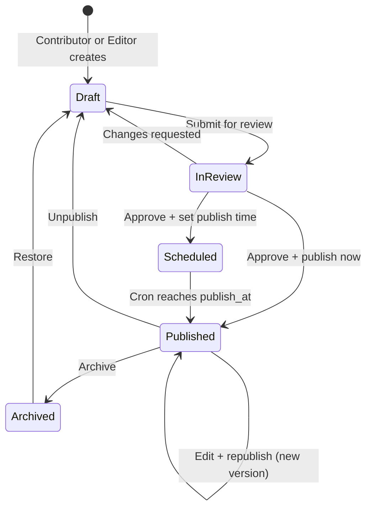
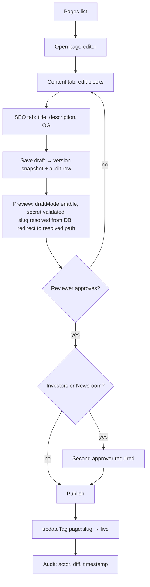

# Ideal Engineering — Application Specification

**The single source of truth for how this application behaves.** Every route, every
component, every input, every user flow — public and administrative — is specified here.
Build against this document; when the app changes, change this document in the same commit.

| | |
| --- | --- |
| Application | Corporate website for **Ideal Engineering & Infrastructure Limited** (IEL) |
| Repository | `Ketankham/ideal-power` |
| Stack | Next.js 16.2.12 (App Router) · React 19.2.4 · TypeScript 5 strict · Tailwind CSS v4 |
| Deployment target | AWS ECS Fargate + ALB + CloudFront |
| Public site | **Built** — 11 routes, fully static |
| Admin platform | **Not built** — specified in §10, planned in [`ADMIN-PLAN.md`](ADMIN-PLAN.md) |
| Last reviewed | 2026-08-01 |

### How to use this document

- **§1–§9** describe *what exists today*. Statements there are verifiable against the code.
- **§10** describes *what will be built* (the admin platform). It is the contract for that work.
- **§13** is the honest list of what is missing or stubbed. Nothing in §1–§9 hides a gap;
  every gap is given an ID (`GAP-nn`) and referenced from the section where it bites.
- Sibling documents, deliberately not duplicated here:
  - [`ADMIN-PLAN.md`](ADMIN-PLAN.md) — admin/AWS *architecture and phasing* (the how)
  - [`DESIGN-SYSTEM.md`](DESIGN-SYSTEM.md) — colour, type, motion, primitives (the look)
  - [`../AGENTS.md`](../AGENTS.md) — rules for AI coding agents working in this repo

---

## 1. System overview

### 1.1 What the application is

A public corporate site for a listed Indian infrastructure group. Its job is to present the
group's identity, asset portfolio and operating record to five distinct outside audiences,
and to satisfy the website-disclosure obligations that come with being listed
(SEBI LODR Regulation 46).

It is **read-only to the public**. There is exactly one write surface — the contact
enquiry form — and it is currently not wired to a backend (`GAP-01`).

### 1.2 Runtime shape today

```
Browser
  │
  ▼
Next.js App Router (Node.js runtime)
  │
  ├── Server Components  ── render at build time
  │        │
  │        └── read from ── src/lib/site.ts        (17 content collections)
  │                         src/lib/businesses.ts  (5 business entities)
  │                         inline page constants  (values, benefits, offices, …)
  │
  └── Client Components  ── hydrate for interaction
           Header · Hero · CompanyRail · Footprints · Counter · Reveal · QuickLinks · ContactForm
```

- **All content is hardcoded TypeScript.** There is no database, no CMS, no API route,
  no `fetch` at runtime. Editing copy means editing code and redeploying.
- **All 11 routes are statically renderable.** `/businesses/[slug]` declares
  `generateStaticParams()` and prerenders 5 pages.
- **There is no `proxy.ts`** (Next 16's renamed middleware), no `app/sitemap.ts`,
  no `robots.txt`, no `app/api/*`, and `next.config.ts` is empty.
- **No image files.** All artwork is code-drawn inline SVG (`src/components/Art.tsx`).
  `public/` contains only the five unused stock Next.js icons.

### 1.3 Directory map

```
src/
├── app/
│   ├── layout.tsx              root shell: font, metadata template, Header/Footer/QuickLinks
│   ├── globals.css             @theme tokens, @utility classes, ie-* keyframes
│   ├── page.tsx                /              home
│   ├── about-us/page.tsx       /about-us
│   ├── businesses/page.tsx     /businesses
│   ├── businesses/[slug]/      /businesses/:slug   (5 static)
│   ├── projects/page.tsx       /projects
│   ├── investors/page.tsx      /investors
│   ├── sustainability/page.tsx /sustainability
│   ├── newsroom/page.tsx       /newsroom
│   ├── careers/page.tsx        /careers
│   ├── contact/page.tsx        /contact
│   └── not-found.tsx           404
├── components/                 15 files — see §7
└── lib/
    ├── site.ts                 17 exported collections
    └── businesses.ts           Business[] + getBusiness(slug)
```

---

## 2. Users

### 2.1 Public audiences

The site has no public login. "User type" means *intent*, and each intent has a designed
path through the site. These five drive every navigation and CTA decision in §5.

| # | Audience | What they came for | Entry points | Primary destinations | Success = |
| --- | --- | --- | --- | --- | --- |
| **P1** | **Investor / analyst** | Results, disclosures, governance, registrar details | Nav → Investors (with dropdown straight to sub-sections), footer Investors column, home quick-card | `/investors` §financials, §shareholders, §governance, §disclosures; `/contact#grievances` | Found the quarter's numbers, or reached the Compliance Officer |
| **P2** | **Shareholder (retail)** | Transfer/demat/dividend help, grievance escalation | Footer → Investor Grievances, `/investors` → "Raise a grievance" | `/investors#shareholders`, `/contact#grievances` | Knows the 3-step escalation path and the registrar |
| **P3** | **Journalist / media** | Announcements, media desk, executive bios | Nav → Newsroom | `/newsroom`, media email band | Has the release and the press contact |
| **P4** | **Job seeker** | Open roles, what working here is like, graduate programme | Nav → Careers, home careers card, Spotlight "People of Ideal" | `/careers#roles`, `/contact` | Found a matching role and an apply route |
| **P5** | **Partner / vendor / customer** | Capability proof, asset scale, who to talk to | Home hero → sector, Businesses dropdown | `/businesses/:slug`, `/projects`, `/contact` | Understands the relevant entity's assets and has the right desk email |
| **P6** | *(secondary)* **Community / regulator / student** | ESG record, safety, local footprint | Nav → Sustainability, home Spotlight | `/sustainability`, `/about-us#milestones` | Found the pillar data and the site map of operations |

### 2.2 Internal roles (admin platform — §10)

Not built yet. Four roles, backed by Cognito groups, enforced in the Data Access Layer.

| Role | Who | Can |
| --- | --- | --- |
| **Admin** | Digital/IT owner | Everything, including users, roles, redirects, globals, destructive actions |
| **Editor** | Corp comms, IR team | Create/edit/**publish** pages and collection items, manage media and navigation |
| **Contributor** | Business-unit staff | Create/edit drafts, submit for review; **cannot publish** |
| **Viewer** | Auditor, legal, agency | Read-only across content, versions and audit log |

Full permission matrix: §10.2.

---

## 3. Information architecture

### 3.1 Route table

| Route | File | Rendering | Title (SEO) | Primary audience |
| --- | --- | --- | --- | --- |
| `/` | `app/page.tsx` | Static | `Ideal Engineering \| Power, Highways and Industrial Districts` | All |
| `/about-us` | `app/about-us/page.tsx` | Static | `About Us` | P5, P6 |
| `/businesses` | `app/businesses/page.tsx` | Static | `Businesses` | P5 |
| `/businesses/[slug]` | `app/businesses/[slug]/page.tsx` | Static ×5 via `generateStaticParams` | `{business.name}` via `generateMetadata` | P5, P1 |
| `/projects` | `app/projects/page.tsx` | Static | `Projects` | P5, P1 |
| `/investors` | `app/investors/page.tsx` | Static | `Investor Relations` | P1, P2 |
| `/sustainability` | `app/sustainability/page.tsx` | Static | `Sustainability` | P6 |
| `/newsroom` | `app/newsroom/page.tsx` | Static | `Newsroom` | P3 |
| `/careers` | `app/careers/page.tsx` | Static | `Careers` | P4 |
| `/contact` | `app/contact/page.tsx` | Static | `Contact` | All |
| `*` | `app/not-found.tsx` | Static | — | — |

Title template `%s | Ideal Engineering` is set in `app/layout.tsx`.

### 3.2 In-page anchors (deep-link targets)

These are linked from the header dropdown and the footer, so they are **contract** — renaming
an `id` breaks external links.

| Anchor | Page | Section |
| --- | --- | --- |
| `#milestones`, `#leadership` | `/about-us` | Timeline, Board & executives |
| `#operational`, `#upcoming`, `#highways` | `/projects` | Three asset tables |
| `#financials`, `#shareholders`, `#governance`, `#disclosures` | `/investors` | Four IR sections |
| `#environment`, `#social`, `#governance`, `#safety` | `/sustainability` | Three ESG pillars + safety |
| `#roles` | `/careers` | Open roles list |
| `#grievances` | `/contact` | Shareholder escalation path |

All anchored sections carry `scroll-mt-28` to clear the fixed header.

### 3.3 Navigation model

Source of truth: `nav: NavItem[]` in `src/lib/site.ts`.

```
NavItem  { label, href, children?: NavChild[] }
NavChild { label, href, note? }        // `note` renders as sub-label in the desktop dropdown
```

Two items have children — **Businesses** (5 operating companies, each with a `note`)
and **Investors** (5 anchors into `/investors`). The same array drives the desktop
hover-dropdown and the mobile accordion drawer, so adding a nav item is a one-line change.

---

## 4. Global shell

Mounted for every route by `app/layout.tsx`, in this order:

1. **Skip link** — `<a href="#main">Skip to content</a>`, visually hidden until focused.
2. **`<Header />`** — fixed, client component.
3. **`<main id="main">`** — the route's page.
4. **`<Footer />`** — server component.
5. **`<QuickLinks />`** — floating tray + back-to-top, client component.

Root `<html>` carries the Red Hat Display font variable and `antialiased`.
An inline SVG data-URI favicon (navy square, gold + ember chevrons) is set in metadata.

### 4.1 Header behaviour

| Input / state | Source | Effect |
| --- | --- | --- |
| `pathname` | `usePathname()` | Marks the active nav item; `/` enables transparent-over-hero mode |
| `scrolled` | `window.scrollY > 40` | Switches header from transparent gradient → solid white + blur + shadow |
| `solid` | `scrolled \|\| pathname !== "/"` | Drives logo variant (`light`/`dark`) and all nav link colours |
| `open` | Hover on a nav item with children | Opens the 24rem desktop dropdown; cleared on `mouseleave` of the whole header |
| `drawer` | Hamburger button (`<lg` only) | Slides the mobile panel in; locks `body` scroll while open |
| `mobileOpen` | Chevron tap inside drawer | Expands one submenu accordion (grid-rows 0fr→1fr transition) |

Route change closes the drawer and any dropdown. Two icon buttons — **Search** and
**Accessibility options** — are rendered with correct `aria-label`s but **have no
handlers** (`GAP-02`).

### 4.2 Footer

Four hardcoded link columns (**Company**, **Investors**, **Businesses**, **Sustainability**)
declared inline in `Footer.tsx` — note these are *separate* from `nav` and can drift
(`GAP-03`). Plus: navy identity band with logo, three social links and a "Group Sites"
button; an address band reading `site.address`, `site.regd` and contact details; and a
legal bar with copyright (`new Date().getFullYear()`) and five legal links that all
currently point to `/contact` because those pages do not exist (`GAP-04`).

### 4.3 QuickLinks tray

Fixed bottom-right. A gold "Quick Links" button toggles a 5-item panel (Contact, About Us,
Investor Relations, Ideal Energy, Ideal Highways — hardcoded in the component). A
back-to-top button fades in past `scrollY > 700` and smooth-scrolls to 0.

### 4.4 404

`app/not-found.tsx` — navy panel, `display-1` headline "This page is off the grid",
two CTAs (`/` and `/businesses`). Rendered for unmatched routes and for
`notFound()` thrown by `/businesses/[slug]` on an unknown slug.

---

## 5. Public user flows

### 5.1 Master flow



### 5.2 P1 — Investor finds the quarterly result

| Step | Action | System response |
| --- | --- | --- |
| 1 | Hovers **Investors** in header | Dropdown lists Overview / Financials & Reports / Shareholders' / Governance / Disclosures |
| 2 | Clicks *Financials & Reports* | Navigates to `/investors#financials`, section scrolled clear of the fixed header |
| 3 | Reads the quarterly table | 4 rows from `quarterlies` — Period, Revenue, EBITDA, PAT, Download |
| 4 | Clicks **Download** | ⚠️ Routes to `/contact` — no PDF exists (`GAP-05`) |
| 5 | Alternative: annual reporting cards | 4 `reports` years × 2–3 documents, same placeholder link |

### 5.3 P2 — Shareholder raises a grievance



### 5.4 P4 — Job seeker applies

1. `/careers` → four "why here" benefit cards → `#roles`.
2. Scans 6 `openRoles`, each showing function (eyebrow), title, location, employment type.
3. Clicks **Apply** → routes to `/contact` — there is no application form, no CV upload,
   no ATS (`GAP-06`).
4. Graduate route: closing band → "Register interest" → `/contact`.

### 5.5 P5 — Partner evaluates an operating company

1. Header **Businesses** dropdown (each child shows a one-line `note`) → picks an entity.
2. `/businesses/:slug` renders, in order: `PageHero` → 4-stat navy strip → 3-paragraph
   overview → 4 capability cards → asset list → 3 other-entity cards.
3. **See all projects** → `/projects`, where the full portfolio is tabulated in three groups.
4. `/contact` → desk grid → `vendors@idealengineering.in`.

---

## 6. Page specifications

Each page below lists: the metadata it exports, its hero inputs, and every section with its
data source and rendering component. **"Editable"** marks what an admin will need to control
in §10.

### 6.1 `/` — Home

**Metadata:** inherits root default (`Ideal Engineering | Power, Highways and Industrial Districts`).

| # | Section | Data source | Fields consumed | Component | Editable |
| --- | --- | --- | --- | --- | --- |
| 1 | Hero carousel | `heroSlides` (5) | `kicker?`, `title`, `body` (supports `**bold**`), `href`, `cta`, `art` | `Hero` (client) | ✅ block |
| 2 | At a glance | `site.short`, `site.legal` + inline `quickCards` (3) | `title`, `body`, `href` | inline | ✅ block |
| 3 | Presence across sectors | `sectors` (3) | `name`, `href`, `tone`, `body`, `stat`, `statLabel` | inline + `SkylineBand` | ✅ collection |
| 4 | Our companies | `companies` (5) | `name`, `slug`, `body`, `art` | `CompanyRail` (client) | ✅ collection |
| 5 | Footprints | `footprints` (4) + `locations` (14) | `value`,`unit`,`label` / `name`,`x`,`y`,`type` | `Footprints` (client) | ✅ collection |
| 6 | Beyond the balance sheet | `spotlights` (4) | `icon`, `kicker`, `title`, `body`, `stat`, `statLabel`, `href` | `Spotlight` | ✅ collection |
| 7 | Governance + Newsroom + Careers | inline copy, `news.slice(0,3)` | `date`, `tag`, `title` | inline | ✅ block |
| 8 | Closing CTA | inline | — | inline | ✅ block |
| 9 | Group websites | `groupSites` (10) | `name`, `short`, `href` | `GroupWebsites` | ✅ collection |

**Section-3 tone mapping** (`toneMap` in `page.tsx`): `gold → from-gold-500 to-gold-600`,
`navy → from-navy-700 to-navy-800`, `ember → from-ember-500 to-ember-600`. A new
`tone` value requires a code change (`GAP-07`).

### 6.2 `/about-us`

**Metadata:** title `About Us`; description names the listed entity and its four asset classes.

| # | Section | Data source | Component |
| --- | --- | --- | --- |
| 1 | Page hero (`art="urban"`, crumb *About Us*) | `site.legal` | `PageHero` |
| 2 | Who we are — 3 paragraphs | **inline in the page component** | — |
| 3 | Footprint stat tiles (4) | `footprints` | `Counter` |
| 4 | Four commitments | **inline `values` array** (`title`, `body`) — numbered 01–04 | — |
| 5 | `#milestones` timeline (8) | `milestones` (`year`, `text`) | `Reveal` list |
| 6 | `#leadership` grid (6) | `leadership` (`name`, `role`, `tenure`) — avatar is generated **initials**, no photos | — |
| 7 | Closing CTA → `/contact` | inline | `GoldButton` |

Sections 2 and 4 being inline is the exact anti-pattern the content layer must fix
(Phase 0 in `ADMIN-PLAN.md`) — `GAP-08`.

### 6.3 `/businesses`

**Metadata:** title `Businesses`.

Hero (`art="energy"`) → **Sectors** grid, re-using `sectors` in a different card treatment
(sand card, stat on top) → **Group companies** grid from `companies`, each card showing
`SceneArt` at `h-40` with a navy gradient scrim, name, body and a *View Entity Overview* link.

### 6.4 `/businesses/[slug]` — Business detail

**Params:** `{ slug: string }` — **awaited**, per Next 16 (`params` is a Promise).
**Static params:** all 5 slugs. **Unknown slug → `notFound()` → 404 page.**
**Metadata:** `generateMetadata` → `title: business.name`, `description: business.lead`.

Data contract — `Business` in `src/lib/businesses.ts`:

```ts
type Business = {
  slug: string;            // URL segment, must be unique
  name: string;            // legal entity name — page H1
  sector: string;          // hero eyebrow: Energy | Transportation | Urban Infrastructure
  art: ArtKey;             // hero artwork variant
  lead: string;            // one-sentence summary — hero body AND meta description
  intro: string[];         // 3 paragraphs of overview prose
  stats: { value: string; label: string }[];        // exactly 4 — drives a 4-col strip
  capabilities: { title: string; body: string }[];  // 4 — 2-col card grid
  assets: { name: string; location: string; detail: string }[];  // 3–6 rows
};
```

| # | Section | Notes |
| --- | --- | --- |
| 1 | `PageHero` | eyebrow = `sector`, title = `name`, body = `lead`, crumbs = Businesses › name |
| 2 | Stat strip | `dl` on navy-800; `dt` is `sr-only`, gold `dd` — **assumes 4 stats** (`md:grid-cols-4`) |
| 3 | Entity overview | `intro[]` paragraphs; React key is `p.slice(0,40)` — two paragraphs sharing a 40-char prefix would collide |
| 4 | Capabilities | 2-col card grid |
| 5 | Assets | Divided list, 3-col at `md` |
| 6 | Other group companies | `businesses.filter(x => x.slug !== b.slug).slice(0, 3)` — always the first 3 others, not curated |

The five entities: `ideal-energy`, `ideal-highways`, `ideal-industrial-districts`,
`ideal-smart-metering`, `ideal-transmission`.

### 6.5 `/projects`

**Metadata:** title `Projects`.

Three identically-structured table sections built from a `groups` array, alternating
white/cream backgrounds:

| `id` | Eyebrow | Source | Column headers | Accent dot |
| --- | --- | --- | --- | --- |
| `operational` | Operational | `projects.operational` (7) | Plant · Location · Capacity · Fuel · Commissioned | `bg-gold-500` |
| `upcoming` | Upcoming | `projects.upcoming` (3) | Project · Location · Capacity · Type · Target | `bg-ember-500` |
| `highways` | Transportation | `projects.highways` (4) | Corridor · Location · Length · Structure · Opened | `bg-navy-700` |

All three read the **same row shape** `{ name, location, capacity, fuel, year }` — the
headers differ but the field names do not, so `fuel` holds "Six-lane BOT" for highways.
Worth renaming when the content layer lands. Page closes with the shared `Footprints` map.

### 6.6 `/investors` — highest-compliance page

**Metadata:** title `Investor Relations`.

| Anchor | Section | Source | Shape |
| --- | --- | --- | --- |
| — | Three navy quick tiles | inline | `{t, d, h}` linking to the three anchors |
| `#financials` | Results table + annual reporting | `quarterlies` (4), `reports` (4) | `{period, revenue, ebitda, pat}`; `{year, items[]}` |
| `#shareholders` | Share & registrar facts | inline `shareData` (6) | Listed on · Ticker `IDEALENGG` · ISIN · Face value · FY end · Registrar |
| `#governance` | Board summary + 8 policy documents | inline `governanceDocs` | string[] |
| `#disclosures` | 5 SEBI LODR regulations | inline `disclosures` | `{reg, label}` — Reg 30/33/34/46/62 |
| — | Compliance Officer mailto | `site.investorEmail` | — |

**Every document link on this page routes to `/contact`.** There are no PDFs, no S3 bucket,
no download tracking (`GAP-05`). For a listed company this is the single most important gap
to close — Regulation 46 requires the actual documents to be on the website.

### 6.7 `/sustainability`

**Metadata:** title `Sustainability`.

Hero (`art="grid"`) → 4 animated target tiles (inline `targets`, rendered with `Counter`)
→ three pillar sections generated from `esgPillars`, anchored via an `anchors` map
(`Environment→#environment`, `Social→#social`, `Governance→#governance`) and alternating
cream/white → `#safety` navy band with `SectionHeading tone="light"`, a *Request the ESG
report* CTA (→ `/contact`) and four inline safety stats.

⚠️ The anchor map is keyed by the pillar **title string**. Renaming a pillar in
`esgPillars` silently breaks `#environment`/`#social`/`#governance` — which the footer and
`spotlights` both link to (`GAP-09`).

### 6.8 `/newsroom`

**Metadata:** title `Newsroom`.

`const [lead, ...rest] = news` — the **first item in the array is the lead story**, there is
no `featured` flag and no date sort (`GAP-10`). Lead renders as a large split card; `rest`
render as a 3-col archive grid.

Tag → badge colour map (`tagTone`), falling back to `bg-mist text-navy-700`:

| Tag | Classes |
| --- | --- |
| `Press Release` | `bg-gold-100 text-navy-800` |
| `Results` | `bg-mist text-navy-700` |
| `Announcement` | `bg-cream text-ember-600` |
| `Sustainability` | `bg-emerald-50 text-emerald-700` |

Dates are ISO `YYYY-MM-DD` in data, formatted `en-IN` `dd Month yyyy` for display.
**Every story links back to `/newsroom`** — there is no `/newsroom/[slug]` detail route
(`GAP-11`). Page ends with a media-enquiry band (`media@idealengineering.in`).

### 6.9 `/careers`

**Metadata:** title `Careers`.

Hero (`art="energy"`) → 4 inline `benefits` cards → `#roles` list from `openRoles`
(`title`, `location`, `type`, `fn`), each row: function eyebrow, title, pin-icon location,
employment type, **Apply** → `/contact` → graduate-programme CTA band.

No filtering, no search, no sort, no role detail page, no application capture (`GAP-06`).

### 6.10 `/contact`

**Metadata:** title `Contact`.

| # | Section | Source |
| --- | --- | --- |
| 1 | Hero (`art="metering"`) | — |
| 2 | Two office cards | inline `offices` built from `site.address` / `site.regd`; `tel:` and `mailto:` links |
| 3 | Four desk cards | inline `desks` — investors@ · media@ · vendors@ · careers@ |
| 4 | Enquiry form | `ContactForm` (client) — §9 |
| 5 | `#grievances` escalation | inline 3-step ordered list; references SEBI SCORES / Smart ODR |

---

## 7. Component reference

### 7.1 Inventory

| Component | File | Kind | Consumes | Used by |
| --- | --- | --- | --- | --- |
| `Header` | `Header.tsx` | **client** | `nav` | layout |
| `Footer` | `Footer.tsx` | server | `site` + inline columns | layout |
| `QuickLinks` | `QuickLinks.tsx` | **client** | inline links | layout |
| `Logo` | `Logo.tsx` | server | — | Header, Footer |
| `Hero` | `Hero.tsx` | **client** | `heroSlides` | `/` |
| `PageHero` | `PageHero.tsx` | server | props only | all inner pages |
| `CompanyRail` | `CompanyRail.tsx` | **client** | `companies` | `/` |
| `Footprints` | `Footprints.tsx` | **client** | `footprints`, `locations` | `/`, `/projects` |
| `Spotlight` | `Spotlight.tsx` | server | `spotlights` | `/` |
| `GroupWebsites` | `GroupWebsites.tsx` | server | `groupSites` | `/` |
| `ContactForm` | `ContactForm.tsx` | **client** | inline `subjects` | `/contact` |
| `Reveal` | `Reveal.tsx` | **client** | props only | everywhere |
| `Counter` | `Counter.tsx` | **client** | props only | `/about-us`, `/sustainability`, `Footprints` |
| `Art` | `Art.tsx` | server | `locations` (in `IndiaMap`) | heroes, cards |
| primitives | `ui.tsx` | server | props only | everywhere |

### 7.2 Primitives — `src/components/ui.tsx`

| Export | Props | Behaviour |
| --- | --- | --- |
| `GoldButton` | `href`, `children`, `className?` | Solid gold pill, arrow nudges +4px on hover, `focus-visible` outline. **The primary CTA — one per view.** |
| `GhostButton` | `href`, `children`, `tone?: "dark" \| "light"`, `className?` | Outlined secondary. `light` = on dark backgrounds. |
| `KnowMore` | `href`, `label?` (default `"Know More"`), `tone?: "gold" \| "navy"` | Inline card link with chevron. |
| `SectionHeading` | `eyebrow?`, `title: ReactNode`, `body?`, `tone?: "dark" \| "light"`, `align?: "left" \| "center"`, `className?` | Eyebrow (with 2rem hairline rule) + `display-2` + body. `max-w-4xl`, or `max-w-3xl` centred. |
| `RichText` | `text`, `className?` | Splits on `/(\*\*[^*]+\*\*)/g`; renders `**…**` as `<strong>`. **This is the entire supported markup.** |
| `ArrowRight` `Chevron` `ChevronDown` | `className?` | Inline SVG, `aria-hidden`, `currentColor`. |

### 7.3 Behavioural components

**`Hero`** *(client)* — 5-slide crossfade carousel.
Autoplay `DURATION = 7200ms`; pauses on `mouseenter`, resumes on `mouseleave`.
Prev/next buttons and numbered `01…05` slide buttons (`aria-current` on active).
Active slide shows a gold progress bar driven by an inline `@keyframes ie-progress`.
Slide artwork gets `.slide-art` (14s slow zoom). Wrapper has
`aria-roledescription="carousel"`; inactive slides are `aria-hidden`.
⚠️ Autoplay does not stop under `prefers-reduced-motion` — only the zoom does (`GAP-12`).

**`PageHero`** *(server)* — the standard inner-page header.
Props: `eyebrow?`, `title`, `body?`, `art?: ArtKey` (default `"grid"`),
`crumbs?: {label, href}[]`. Renders a breadcrumb `<nav aria-label="Breadcrumb">` that
**always prepends Home**, then `display-1` title (`max-w-[18ch]`) over `SceneArt` with a
navy left-to-right scrim.

**`Reveal`** *(client)* — scroll fade-rise.
Props: `children`, `delay?` (ms, → `animationDelay`, used for staggering),
`className?`, `as?: "div" | "li" | "section" | "article"`.
IntersectionObserver at `threshold: 0.12`, `rootMargin: "0px 0px -8% 0px"`, fires once then
disconnects. Falls back to visible when `IntersectionObserver` is undefined. Honours
`prefers-reduced-motion` via CSS.

**`Counter`** *(client)* — count-up on view.
Props: `value: string`, `className?`. Parses `value` after stripping commas; preserves
decimal places and `en-IN` grouping. 1500ms, cubic ease-out, `threshold: 0.4`, runs once.
Snaps straight to `value` under `prefers-reduced-motion`, and renders `value` verbatim if
it does not parse as a number.

**`CompanyRail`** *(client)* — horizontal snap carousel of `companies`.
Card width `85vw` → `22rem` at `sm` → `24rem` at `lg`; scroll step = card width + 24px.
Scrollbar hidden; prev/next buttons + "View all businesses" link.

**`Footprints`** *(client)* — India map + stat rail.
Plots all 14 `locations` as absolutely-positioned buttons at `left: x%`, `top: y%` over
`IndiaMap`. Each pin has a staggered `ie-pulse-dot` halo and a tooltip on
hover **and focus** showing `name` + `type`. Right column: `display-2` heading and four
`footprints` stats via `Counter`.

**`Art`** *(server)* — all illustration, code-drawn.
`SceneArt({ id, variant, className })` where `variant: ArtKey` is
`energy | highway | urban | metering | grid`; `id` namespaces the SVG's internal gradient
IDs so multiple instances on one page do not collide. Also `SkylineBand({className})` and
`IndiaMap({className})`.

**`Logo`** — `variant?: "dark" | "light"`, `className?`. SVG wordmark where the "A" of
IDEAL is a gold + ember chevron pair; the "ENGINEERING & INFRASTRUCTURE" descriptor is
hidden below `sm`. Always links to `/`.

### 7.4 Server / client rule

Keep components Server Components unless they need state, effects or browser APIs.
Today only `Header`, `Hero`, `CompanyRail`, `Footprints`, `Counter`, `Reveal`,
`QuickLinks` and `ContactForm` are `"use client"`.

---

## 8. Content model (as-is)

Everything below lives in `src/lib/`. Column **"Admin tier"** maps each collection onto
the four-tier model in `ADMIN-PLAN.md` §3.

### 8.1 `src/lib/site.ts`

| Export | Count | Shape | Rendered on | Admin tier |
| --- | --- | --- | --- | --- |
| `site` | 1 | `{name, short, legal, tagline, email, investorEmail, phone, address{line1,line2,state}, regd{line1,line2,state,cin}}` | layout, footer, contact, about, home | **Global** |
| `nav` | 8 | `{label, href, children?: {label, href, note?}[]}` | Header (desktop + mobile) | **Global** |
| `heroSlides` | 5 | `{kicker?, title, body, href, cta, art}` | `/` | Block |
| `sectors` | 3 | `{name, href, tone: gold\|navy\|ember, body, stat, statLabel}` | `/`, `/businesses` | Collection |
| `companies` | 5 | `{name, slug, body, art}` | `/`, `/businesses` | Collection |
| `footprints` | 4 | `{value, unit, label}` | `/`, `/about-us`, `/projects` | Collection |
| `locations` | 14 | `{name, x, y, type}` — **x/y are % of map viewport** | `Footprints` map | Collection |
| `milestones` | 8 | `{year, text}` | `/about-us#milestones` | Collection |
| `leadership` | 6 | `{name, role, tenure}` | `/about-us#leadership` | Collection |
| `news` | 6 | `{date: ISO, tag, title, body}` | `/newsroom`, `/` | Collection |
| `reports` | 4 | `{year, items: string[]}` | `/investors#financials` | Collection |
| `quarterlies` | 4 | `{period, revenue, ebitda, pat}` | `/investors#financials` | Collection |
| `projects` | 14 | `{operational[], upcoming[], highways[]}` each `{name, location, capacity, fuel, year}` | `/projects` | Collection |
| `esgPillars` | 3 | `{title, body, points: string[]}` | `/sustainability` | Collection |
| `spotlights` | 4 | `{icon: SpotlightIcon, kicker, title, body, stat, statLabel, href}` | `/` | Collection |
| `groupSites` | 10 | `{name, short, href}` | `/` | Collection |
| `openRoles` | 6 | `{title, location, type, fn}` | `/careers#roles` | Collection |

Enums that will become admin dropdowns:

- `ArtKey` = `energy | highway | urban | metering | grid`
- `SpotlightIcon` = `institute | leaf | community | people`
- `sectors[].tone` = `gold | navy | ember`

### 8.2 `src/lib/businesses.ts`

`businesses: Business[]` (5) plus `getBusiness(slug)`. Full type in §6.4.
**Admin tier: Collection with its own public route** — so each item needs its own SEO block.

### 8.3 Content still inline in page components (`GAP-08`)

| Constant | File | Items |
| --- | --- | --- |
| `quickCards` | `app/page.tsx` | 3 |
| `toneMap` | `app/page.tsx` | 3 |
| `values` | `app/about-us/page.tsx` | 4 |
| `shareData`, `governanceDocs`, `disclosures` | `app/investors/page.tsx` | 6, 8, 5 |
| `targets`, `anchors`, safety stats | `app/sustainability/page.tsx` | 4, 3, 4 |
| `groups` | `app/projects/page.tsx` | 3 |
| `benefits` | `app/careers/page.tsx` | 4 |
| `offices`, `desks`, escalation steps | `app/contact/page.tsx` | 2, 4, 3 |
| `tagTone` | `app/newsroom/page.tsx` | 4 |
| `columns` | `components/Footer.tsx` | 4 |
| `subjects` | `components/ContactForm.tsx` | 6 |
| `links` | `components/QuickLinks.tsx` | 5 |
| `badgeTones` | `components/GroupWebsites.tsx` | 5 |

All of it must move into the content layer in Phase 0.

---

## 9. Forms and data capture

### 9.1 Contact enquiry form — field specification

`src/components/ContactForm.tsx`. The **only** input surface on the public site.

| Field | `name` | Type | Required | Constraints today | Should also validate |
| --- | --- | --- | --- | --- | --- |
| Full name | `name` | text | ✅ | HTML `required` | 2–120 chars |
| Organisation | `org` | text | ✕ | — | ≤ 160 chars |
| Email address | `email` | email | ✅ | HTML `required` + `type=email` | RFC-ish + MX-safe, ≤ 254 |
| Phone | `phone` | tel | ✕ | — | E.164 or Indian 10-digit |
| Subject | `subject` | select | ✅ | Empty default disabled; 6 options | Must be one of the enum |
| Message | `message` | textarea (5 rows) | ✅ | — | 10–4000 chars |
| Consent | `consent` | checkbox | ✅ | — | Must be `true`; store timestamp + text version |

Subject options (drive routing once a backend exists):
`General enquiry` · `Investor relations` · `Media enquiry` ·
`Supplier / vendor registration` · `Careers` · `Shareholder grievance`

**States:** `idle → sending → sent`. `sending` disables the submit button and shows
"Sending…". `sent` replaces the form with a tick panel, "Your enquiry has been recorded.
The relevant team will respond within two working days." and a *Send another enquiry*
button returning to `idle`.

**Current implementation is a stub** (`GAP-01`): `onSubmit` calls `preventDefault()`,
waits 700ms and sets `sent`. Nothing is transmitted, stored, or emailed. Two defects
inside the stub:

- `e.currentTarget` is `null` after the `await` (React clears it once the handler returns),
  so `.reset()` throws — invisible to the user because the success state has already
  rendered, but it surfaces as an unhandled rejection in the console.
- No spam protection of any kind: no honeypot, no rate limit, no CAPTCHA, no bot check.

### 9.2 Required backend contract (to build)

```
POST /api/contact                 (Server Action preferred)
  body   → the 7 fields above
  server → 1. Zod parse; reject with field-level errors
           2. Honeypot + rate limit by IP (and Vercel/AWS WAF rule)
           3. INSERT INTO form_submissions (form='contact', payload_json, status='new')
           4. SES notification to the desk mapped from `subject`
           5. SES acknowledgement to the submitter
  returns → { ok: true, reference: "IEL-2026-000123" }
```

Subject → desk routing: Investor relations & Shareholder grievance → `investors@`;
Media → `media@`; Supplier/vendor → `vendors@`; Careers → `careers@`;
General → `connect@`. All submissions land in the admin **Forms** inbox (§10.3).

### 9.3 Careers applications (`GAP-06`)

Not implemented. Minimum viable capture when built: role reference, name, email, phone,
current employer, notice period, CV upload (PDF/DOCX ≤ 5 MB, virus-scanned, private S3
prefix), consent. Retention policy must be explicit before collecting CVs.

---

## 10. Admin platform specification

> **Status: not built.** This section is the functional contract; `ADMIN-PLAN.md` holds the
> architecture, phasing and AWS decisions. Locked decisions: **custom-built admin at
> `/admin` inside this Next.js app**, **ECS Fargate**, **Cognito auth**, **RDS PostgreSQL**,
> **S3 media**.

### 10.1 Core principle — one schema registry

Every content type is declared **once** as a schema; the admin form, the validation, the
TypeScript type and the public renderer all derive from that declaration.

```
src/cms/blocks/<type>.ts
  type       "hero-carousel"
  label      "Hero Carousel"
  schema     Zod object
  defaults   seed value for a newly added block
  Component  the existing React renderer
```

**Adding a new section type = adding one file. Zero admin-panel changes.** Field widget
vocabulary: `text` · `textarea` · `richText` (bold only, matching `RichText`) · `number` ·
`boolean` · `select` · `date` · `url`/`internalLink` · `image` · `file` · `colorTone`
(`gold`/`navy`/`ember`) · `icon` (`SpotlightIcon`) · `artKey` (`ArtKey`) · `array<T>`
(sortable) · `object<T>` · `reference<Collection>` · `coordinate` (map click-picker for
`locations.x/y`).

**Scope boundary:** structured editing inside fixed page templates — editors may edit any
field, reorder/add/remove blocks from an allowed list, and toggle sections on or off. They
may **not** invent arbitrary layouts.

### 10.2 Permission matrix

| Capability | Admin | Editor | Contributor | Viewer |
| --- | :-: | :-: | :-: | :-: |
| View admin, content and versions | ✅ | ✅ | ✅ | ✅ |
| Create / edit **draft** page or item | ✅ | ✅ | ✅ | ✕ |
| Submit for review | ✅ | ✅ | ✅ | ✕ |
| **Publish** / unpublish | ✅ | ✅ | ✕ | ✕ |
| Schedule a publish | ✅ | ✅ | ✕ | ✕ |
| Restore a previous version | ✅ | ✅ | ✕ | ✕ |
| Upload media / edit alt text | ✅ | ✅ | ✅ | ✕ |
| **Delete** media | ✅ | ✅ (unused only) | ✕ | ✕ |
| Edit navigation / footer | ✅ | ✅ | ✕ | ✕ |
| Edit globals (identity, contact, CIN) | ✅ | ✕ | ✕ | ✕ |
| Manage redirects, robots, sitemap rules | ✅ | ✅ | ✕ | ✕ |
| Read form submissions | ✅ | ✅ | ✕ | ✅ |
| Export submissions to CSV | ✅ | ✅ | ✕ | ✕ |
| Manage users and roles | ✅ | ✕ | ✕ | ✕ |
| Read audit log | ✅ | ✅ | ✕ | ✅ |
| **Publish anything under `/investors`** | ✅ | ✅ *(requires a second approver)* | ✕ | ✕ |

Enforcement is in the **Data Access Layer** (`server-only`, `verifySession()` memoised with
React `cache()`), called inside *every* admin read and *every* Server Action.
`proxy.ts` does only the cheap "no cookie → redirect to login" check — per the Next 16 docs
it is **not** an authorization boundary.

### 10.3 Admin information architecture

```
/admin
├── Dashboard        recent edits · scheduled publishes · pending reviews · unread submissions
├── Pages            list → edit (Content | SEO | Settings) → preview → publish
├── Collections      businesses · news · projects · reports · quarterlies · leadership ·
│                    milestones · openRoles · locations · esgPillars · spotlights ·
│                    groupSites · sectors · companies · footprints
├── Media            S3 library · upload · alt text · focal point · usage map
├── Navigation       header tree · footer columns · quick links
├── Globals          identity · contact · registered office · CIN · social · analytics
├── SEO              robots.txt · sitemap controls · redirects · JSON-LD defaults
├── Forms            contact + careers submissions · status · assignment · CSV export
├── Users & Roles    Cognito-backed · invite · role · deactivate
└── Activity         audit log · version history · diff & restore
```

**Screen input specifications**

| Screen | Inputs | Actions | Notes |
| --- | --- | --- | --- |
| **Pages → list** | search, status filter, template filter | New, Edit, Duplicate, Archive | One row per route in §3.1 |
| **Pages → Content tab** | ordered block list; per-block form generated from its Zod schema | Add block (allowed list), reorder (drag), toggle enabled, remove, per-field edit | Live character counters on `title`/`body` |
| **Pages → SEO tab** | meta title (with `%s \| Ideal Engineering` preview + counter), meta description, canonical override, OG title/description/image/type, Twitter card + image, robots index/follow, JSON-LD, sitemap include + changefreq + priority | Save, Preview OG card | Applies to Pages **and** routed collection items |
| **Pages → Settings tab** | slug, template, status, publish-at, author, review notes | Save, Submit for review, Publish, Schedule, Unpublish | Slug change auto-offers a 301 redirect |
| **Collections → item** | schema-generated form + SEO block if routed | Save draft, Submit, Publish, Reorder, Archive | Reorder writes `position` |
| **Media** | file (presigned direct-to-S3), alt text **(required)**, caption, credit, focal point, tags | Upload, Replace, Delete (blocked if in use) | `media_usage` prevents deleting a live asset |
| **Navigation** | tree builder: label, href (route picker), note, children, order | Save, Preview | Drives `nav`; must also cover footer columns (`GAP-03`) |
| **Globals** | name, short, legal, tagline, emails, phone, corporate + registered address, CIN, socials, analytics IDs | Save | Admin-only; every change invalidates the `globals` cache tag |
| **SEO** | robots.txt body, redirect rows (from, to, 301/308, enabled), JSON-LD defaults | Save, Test redirect | Sitemap is generated from the DB, never hand-edited |
| **Forms** | filters (form, status, date), per-row status + assignee + internal note | Assign, Mark resolved, Export CSV | Retention policy field per form |
| **Users & Roles** | email, name, role, status | Invite, Change role, Deactivate | MFA enforced; no public sign-up |
| **Activity** | entity filter, actor filter, date range | View diff, Restore | Append-only; never editable |

### 10.4 Content lifecycle



Every transition writes an `audit_log` row (actor, action, entity, diff, IP, timestamp) and
a `versions` snapshot. Publishing calls `updateTag()` for the affected cache tags
(`page:<slug>`, `collection:<name>`, `item:<collection>:<id>`, `globals`) so the editor
immediately sees their own write; bulk/global invalidation uses `revalidateTag()`.

### 10.5 Admin flows

**A. Sign in**

```mermaid
flowchart LR
    A[/admin/*] --> B{Session cookie?}
    B -->|no| C[/admin/login/]
    B -->|yes| D[DAL verifySession<br/>JWT vs Cognito JWKS]
    C --> E[Cognito hosted UI + MFA] --> F[Set httpOnly Secure SameSite=Lax cookie] --> D
    D -->|invalid| C
    D -->|valid| G{Role allows this screen?}
    G -->|no| H[403]
    G -->|yes| I[Render admin]
```

**B. Edit and publish a page**



**C. Upload media** — pick file → server issues presigned PUT → browser uploads **directly
to S3** (never proxied through Next) → server records `media` row (key, mime, dimensions,
size) → editor supplies **required alt text**, optional caption/credit/focal point →
asset selectable in any `image` field → `media_usage` rows written on save.

**D. Publish a regulatory disclosure** *(the highest-stakes flow)* — Contributor drafts a
`/investors` item and attaches the PDF (investor-document bucket: versioning on, Object
Lock considered) → submits → Editor reviews → **second approver** → publish → cache tags
updated → audit row is immutable and timestamped. Answers "who changed which number, when,
and what did it say before".

**E. Rename a URL** — change slug in Settings → system offers a 301 from the old path →
redirect row created → sitemap regenerates from the DB → old URL keeps working.

**F. Triage a form submission** — submission arrives → routed by `subject` → appears in
Forms inbox as `new` → assignee set → status `in progress` → `resolved` with a note →
exportable to CSV.

**G. Restore a previous version** — Activity → entity history → diff two versions
side-by-side → Restore → creates a **new** version equal to the old content (never
rewrites history) → republish.

### 10.6 Use cases

| ID | Use case | Actor | Trigger | Acceptance criteria |
| --- | --- | --- | --- | --- |
| **UC-01** | Change a hero headline | Editor | Marketing copy update | Edit → preview → publish; live within 1 page load; old copy recoverable from version history |
| **UC-02** | Publish quarterly results | Editor + approver | Board approves results | New `quarterlies` row + PDF; two-approver gate enforced; audit row shows both actors |
| **UC-03** | Add a press release | Editor | Announcement issued | Item with date, tag, title, body, SEO; appears on `/newsroom` and in the home 3-item list; requires `/newsroom/[slug]` (`GAP-11`) |
| **UC-04** | Add a sixth operating company | Admin | New subsidiary | Collection item created; `/businesses/<slug>` live; nav child, `groupSites` tile and footer link all updated from one place |
| **UC-05** | Update the registered office / CIN | Admin | Statutory change | Globals edit propagates to footer, `/contact` and JSON-LD; `globals` tag invalidated site-wide |
| **UC-06** | Post an open role | Editor | New vacancy | Role live at `/careers#roles`; expires automatically on a close date |
| **UC-07** | Retire a page and redirect it | Admin | Restructure | 301 created, sitemap updated, no 404s for the old URL |
| **UC-08** | Swap a hero image | Editor | Rebrand | Upload with alt text; usage map shows every page referencing it before replace |
| **UC-09** | Prevent deletion of a live asset | Editor | Cleanup | Delete blocked with a list of referencing entities |
| **UC-10** | Schedule an embargoed release | Editor | Embargo 07:00 | Scheduled state; publishes automatically; not reachable before the time except in Draft Mode |
| **UC-11** | Onboard a new editor | Admin | Team change | Cognito invite, MFA enrolment, role assigned, first login audited |
| **UC-12** | Prove who changed a number | Viewer (auditor) | Regulator query | Audit log filtered by entity returns actor, timestamp, before/after diff |
| **UC-13** | Export contact submissions | Editor | Monthly reporting | CSV of the filtered set; export itself is audited |
| **UC-14** | Reorder ESG pillars | Editor | Narrative change | Drag reorder persists `position`; **anchors must remain stable** (`GAP-09`) |
| **UC-15** | Correct a typo on `/investors` | Editor | Error spotted | Same two-approver gate as UC-02 — no fast path on a disclosure page |

---

## 11. SEO specification

### 11.1 Today

- `metadataBase`: `https://www.idealengineering.in`
- Title template: `%s | Ideal Engineering`; default title includes the tagline
- Root `description` and `openGraph` (type, siteName, title, description) set in `layout.tsx`
- Every page exports `metadata` with `title` + `description`;
  `/businesses/[slug]` uses `generateMetadata`
- Favicon: inline SVG data URI
- Breadcrumb `<nav aria-label="Breadcrumb">` on every inner page (visual only)
- Semantic headings: exactly one `h1` per page (`Hero`/`PageHero`), `h2` per section

**Missing** (all admin-phase work): OG **images** (`GAP-13`), `app/sitemap.ts` (`GAP-14`),
`robots.txt` (`GAP-15`), JSON-LD — Organization, BreadcrumbList, NewsArticle (`GAP-16`),
canonical overrides, redirect management (`GAP-17`).

### 11.2 Target — per page and per routed collection item

Meta title (template preview + character counter) · meta description · canonical override ·
OG title/description/image/type · Twitter card type + image · robots index/follow ·
JSON-LD · sitemap include/changefreq/priority. Plus site-wide: robots.txt editor,
DB-generated `sitemap.xml`, redirect manager, `next/og` fallback OG image.

---

## 12. Non-functional requirements

### 12.1 Rendering and caching (Next.js 16 specifics)

Enable **Cache Components** in `next.config.ts` once the DB lands. Read path:
`'use cache'` + `cacheTag('page:'+slug)` + `cacheLife('max')`. Write path in Server Actions:
`updateTag()` for the editor's own publish (immediate, read-your-own-writes),
`revalidateTag()` for background/bulk invalidation. Preview uses **Draft Mode**, not a
separate deployment — and the draft route must validate the secret **and resolve the slug
from the DB**, redirecting to the resolved path, never the raw query param (open-redirect
risk).

### 12.2 Accessibility

Committed today: skip link · one `h1` per page · `aria-label`ed breadcrumb, primary and
mobile nav · `aria-hidden` on decorative SVG and inactive carousel slides · `aria-current`
on the active slide · visible `focus-visible` outlines on `GoldButton` · map pins reachable
by keyboard with tooltips on focus · `prefers-reduced-motion` block disabling `.reveal`,
`.slide-art`, `.marquee-track`, `.spin-slow`, and `Counter` snapping to its final value.

**Any new animation must be added to that reduced-motion block.**

Open: hero autoplay under reduced motion (`GAP-12`); non-functional Search and
Accessibility buttons (`GAP-02`); no formal WCAG 2.2 AA audit yet (`GAP-18`).

### 12.3 Security

Public site has no auth and one (stubbed) write path. Once the admin and forms exist:
Cognito with enforced MFA and no public sign-up · httpOnly + Secure + SameSite=Lax session
cookie · DAL-enforced authorization on every read and action · nonce-based CSP set in
`proxy.ts` · WAF managed rules plus rate limiting on `/admin` and the login endpoint ·
secrets in Secrets Manager (DB creds, `NEXT_SERVER_ACTIONS_ENCRYPTION_KEY`, draft-mode
secret) · presigned S3 uploads to a private bucket behind CloudFront OAC.

### 12.4 Performance budget

Static HTML, zero runtime data fetching, no images to optimise, one Google font with
`display: swap`. Keep it that way: no client component without a stateful reason, no
blocking third-party script, images (when they arrive) through `next/image` with
`remotePatterns` for the media domain and `sharp` installed on the Fargate image.

---

## 13. Known gaps and backlog

| ID | Gap | Impact | Where | Phase |
| --- | --- | --- | --- | --- |
| **GAP-01** | Contact form has no backend; `.reset()` throws after `await` | Enquiries are silently lost | §9.1 | 4 (or sooner) |
| **GAP-02** | Header Search and Accessibility buttons do nothing | Dead controls in the primary nav | §4.1 | — |
| **GAP-03** | Footer columns hardcoded, separate from `nav` | Navigation drift | §4.2 | 3 |
| **GAP-04** | Sitemap / Privacy / Cookie / Legal / Terms pages do not exist | Legal exposure for a listed company | §4.2 | 2 |
| **GAP-05** | No investor PDFs — every download links to `/contact` | **SEBI LODR Reg 46 non-compliance** | §6.6 | 2 |
| **GAP-06** | No careers application capture | Candidates cannot apply | §6.9, §9.3 | 4 |
| **GAP-07** | `sectors[].tone` requires a code change per new value | Blocks editor self-service | §6.1 | 3 |
| **GAP-08** | ~60 content items still inline in page components | Cannot be edited without a deploy | §8.3 | 0 |
| **GAP-09** | Sustainability anchors keyed by pillar title string | Renaming a pillar breaks footer + spotlight links | §6.7 | 0 |
| **GAP-10** | Newsroom lead = `news[0]`; no sort, no featured flag | Wrong story can lead | §6.8 | 3 |
| **GAP-11** | No `/newsroom/[slug]` detail route | Releases are not linkable or shareable | §6.8 | 3 |
| **GAP-12** | Hero autoplay ignores `prefers-reduced-motion` | Accessibility | §7.3 | — |
| **GAP-13** | No OG images | Poor link previews | §11.1 | 2 |
| **GAP-14** | No `app/sitemap.ts` | Crawl coverage | §11.1 | 2 |
| **GAP-15** | No `robots.txt` | Crawl control | §11.1 | 2 |
| **GAP-16** | No JSON-LD | No rich results | §11.1 | 2 |
| **GAP-17** | No redirect management | Broken links the moment URLs change | §11.1 | 2 |
| **GAP-18** | No WCAG 2.2 AA audit, no automated a11y test | Unknown compliance | §12.2 | — |
| **GAP-19** | No test suite at all | No regression safety net | — | 0 |
| **GAP-20** | `next.config.ts` empty — no Cache Components, no `images` config | Blocks the CMS caching model | §12.1 | 0 |
| **GAP-21** | No `proxy.ts`, no `/api/health`, no `instrumentation.ts` | Blocks admin auth, ALB health checks, tracing | §12.1 | 1/5 |
| **GAP-22** | Social links point at generic linkedin.com / facebook.com / youtube.com | Dead-end outbound links | §4.2 | 2 |
| **GAP-23** | `/projects` rows reuse `fuel` for highway structure type | Confusing field semantics | §6.5 | 0 |

Delivery ordering for these lives in `ADMIN-PLAN.md` §8 (Phases 0–5).

---

## 14. Extending the app

### Adding a page
1. `src/app/<route>/page.tsx`, default-export a Server Component.
2. `export const metadata` with `title` (template appends the brand) and `description`.
3. Open with `<PageHero eyebrow title body art crumbs>`.
4. Wrap every section in `container-x`; wrap animated blocks in `<Reveal>` with staggered
   `delay`.
5. Add it to `nav` (`src/lib/site.ts`) **and** the relevant footer column.
6. Add the route to §3.1 of this document.

### Adding a content collection
1. Export a typed array from `src/lib/site.ts` — never inline it in a page (`GAP-08`).
2. Document its shape in §8.1 here.
3. Once the CMS exists, register a matching schema in `src/cms/`.

### Adding a component
1. Server Component by default; `"use client"` only for state, effects or browser APIs.
2. Compose with Tailwind utilities and existing tokens; reach for `@utility` only when a
   pattern repeats across many files.
3. New animation → add it to the `prefers-reduced-motion` block in `globals.css`.
4. Interactive elements need a visible focus state.
5. Add it to §7.1 here and, if it is a primitive, to `DESIGN-SYSTEM.md`.

### Before writing any Next.js code
Read the relevant guide in `node_modules/next/dist/docs/`. This version has breaking
changes: middleware is `proxy.ts`, `params` is a Promise, caching is the Cache Components
model. See [`../AGENTS.md`](../AGENTS.md).

---

## 15. Glossary

| Term | Meaning |
| --- | --- |
| **ArtKey** | `energy \| highway \| urban \| metering \| grid` — which code-drawn SVG scene a hero or card uses |
| **Block** | A schema-defined, reorderable section on a page |
| **BOT / HAM / Annuity** | Highway concession structures (build-operate-transfer, hybrid annuity, annuity) |
| **CIN** | Corporate Identity Number — statutory, must appear in the footer |
| **DAL** | Data Access Layer — the `server-only` module where authorization is actually enforced |
| **Draft Mode** | Next.js cookie-based bypass of caching, used for editor preview |
| **Globals** | Singleton content (identity, contact, nav) used across every page |
| **LODR** | SEBI Listing Obligations and Disclosure Requirements Regulations, 2015 |
| **MDM** | Meter Data Management (smart metering business) |
| **PPA** | Power Purchase Agreement |
| **TBCB** | Tariff-Based Competitive Bidding (transmission projects) |
| **Tone** | Three unrelated props share this name — see `DESIGN-SYSTEM.md`; they are **not** interchangeable |

---

## 16. Related documents

| Document | Covers |
| --- | --- |
| [`ADMIN-PLAN.md`](ADMIN-PLAN.md) | Admin architecture, AWS services, self-hosting gotchas, data model, phased roadmap, open decisions |
| [`DESIGN-SYSTEM.md`](DESIGN-SYSTEM.md) | Colour tokens, type scale, layout container, motion, component primitives, conventions |
| [`../README.md`](../README.md) | Stack, scripts, repo layout, content warning |
| [`../AGENTS.md`](../AGENTS.md) | Next.js 16 rules for AI coding agents |
